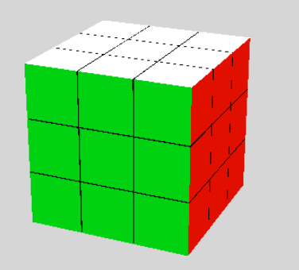

# Bienvenue sur le simulateur de Rubik's cube

## Qu'est-ce que c'est ?
Un simulateur de rubik's cube en 3D que j'ai fait dans le cadre d'un TP.

## Langage
* HTML/CSS/JS
* Librairie [threejs](https://threejs.org/)

## A venir ?
* Amélioration des graphismes du cube (peut-être)
* Changement du type de contrôle de la camera pour pouvoir tourner entièrement autour du cube

## Contact
Si vous avez des questions, je suis disponible à cette adresse: vianney.chepeau@gmail.com

